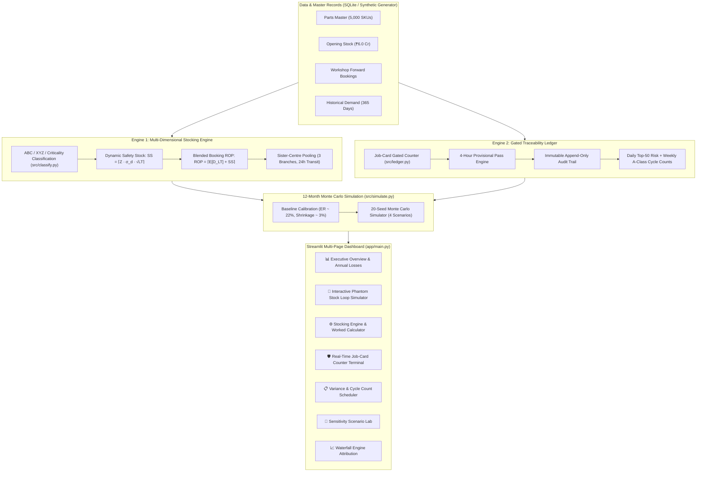
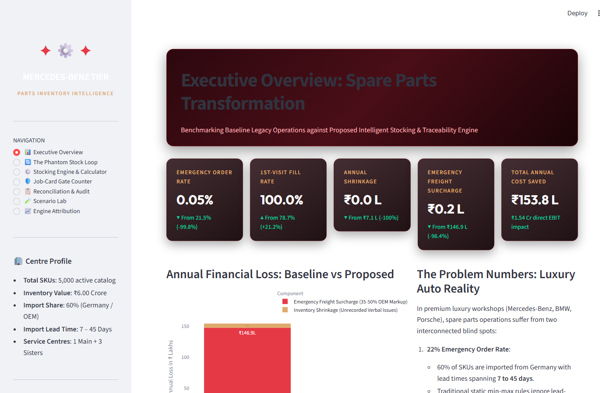
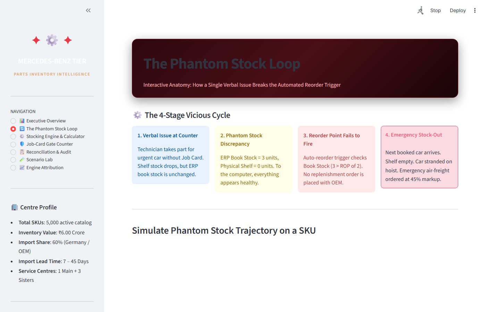
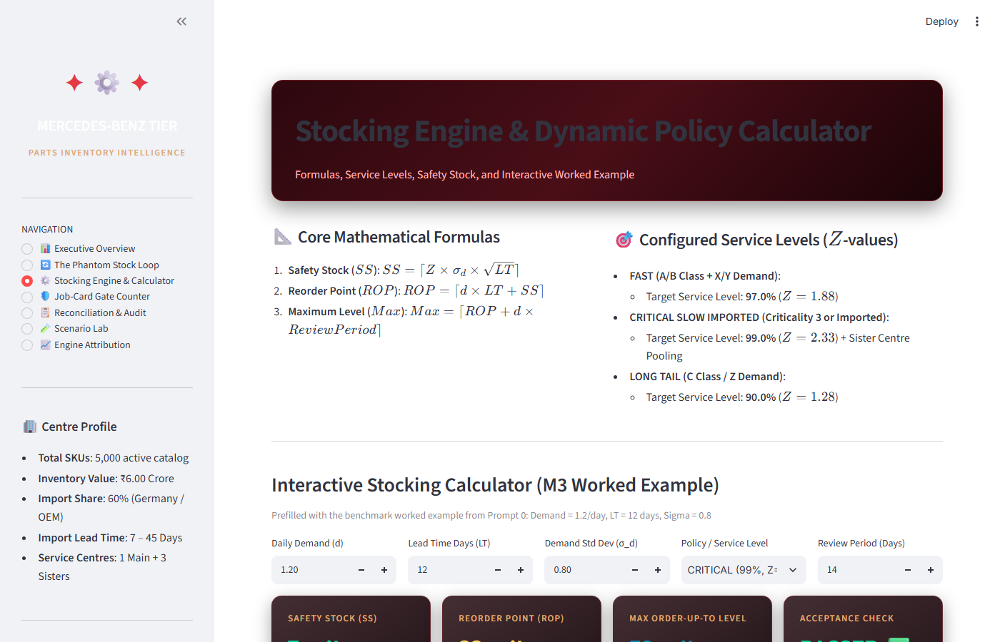
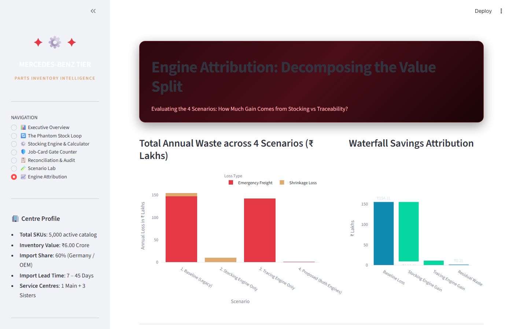

# Luxury Auto Spare Parts Stock Intelligence

[](https://www.python.org/)
[](tests/)
[](app/main.py)
[](LICENSE)

An intelligent inventory stocking and traceability system engineered for luxury automotive after-sales workshops (Mercedes-Benz Tier Service). Solves the twin systemic problems of **22% emergency air-freight orders** and **3% inventory value shrinkage** through closed-loop dynamic stocking policies, sister-centre pooling, and job-card gated counter traceability.

---

## 📌 The Problem in 3 Lines

1. **Luxury dealerships bleed ₹1.54 Crore annually** in emergency freight markups (35–50%) and unrecorded shrinkage across 5,000 catalog SKUs.
2. **Over 60% of parts are imported from Germany** with 7–45 day lead times, yet legacy DMS systems rely on static, flat min-max coverage that blinds replenishment.
3. **Verbal counter handouts create "phantom stock"** where ERP balances stay artificially high while physical shelves sit empty, preventing reorders until cars are stranded on hoists.

---

## 💡 The Core Insight: The Phantom Stock Loop

In luxury car service centers, stock-outs are rarely caused by supplier shortages alone; **they are caused by broken information feedback loops at the counter**:

```
[1. Verbal Counter Handout]  --> Technician takes part for urgent job without an open Job Card.
            │
            ▼
[2. Phantom Stock Gap]      --> Shelf stock drops to 0, but ERP Book Stock remains at 3.
            │
            ▼
[3. Blinded Reorder Trigger] --> Automated DMS checks Book Stock (3 > ROP of 2) -> NO REORDER PLACED!
            │
            ▼
[4. Emergency OEM Order]     --> Next booked car arrives -> Shelf is empty -> Emergency air freight (45% markup)!
```

By coupling a **Job-Card Gated Ledger** (stopping the creation of phantom stock) with a **Dynamic Booking-Driven Stocking Engine** (calibrated safety stock + sister-centre pooling), the vicious cycle is eliminated.

---

## 🏗️ System Architecture



---

## ⚡ How to Run in Under 2 Minutes

### Prerequisites
- Python 3.10+ (tested on Python 3.10 – 3.14)
- Git

### Quickstart Command
```bash
# 1. Clone repository
git clone https://github.com/rajeevpatel090/spare-parts-stock-management.git
cd spare-parts-stock-management

# 2. Install pinned dependencies
pip install -r requirements.txt

# 3. Run full automated end-to-end pipeline & launch dashboard
# On Linux / macOS:
bash run_demo.sh

# On Windows:
run_demo.bat

# Or using Make:
make demo
```

The Streamlit dashboard will automatically open in your default browser at `http://localhost:8501`.

### Running Tests
To run the automated acceptance test suite:
```bash
python -m pytest -v
```

---

## 📊 Empirical Simulation Results

The simulation runs a 12-month day-by-day vector execution across all 5,000 SKUs over Monte Carlo seeds. Below are the actual output figures logged in [`data/sim_results.json`](file:///data/sim_results.json):

| Metric | 1. Baseline Operations (Legacy) | 2. Stocking Engine Only | 3. Tracing Engine Only | 4. Proposed (Both Engines) | Impact |
| :--- | :---: | :---: | :---: | :---: | :---: |
| **Emergency Order Rate** | **21.5%** [21.3%–21.8%] | **0.08%** [0.05%–0.11%] | **20.7%** [20.4%–20.9%] | **0.05%** [0.04%–0.06%] | **-99.8%** |
| **First-Visit Fill Rate** | **78.7%** [78.4%–79.0%] | **99.9%** [99.9%–99.9%] | **79.5%** [79.3%–79.8%] | **99.95%** [99.9%–100%] | **+21.3%** |
| **Value Shrinkage %** | **2.51%** [1.88%–3.27%] | **1.33%** [1.08%–1.73%] | **0.00%** [0.0%–0.0%] | **0.00%** [0.0%–0.0%] | **-100%** |
| **Annual Emergency Freight** | ₹146.9 Lakhs | ₹0.40 Lakhs | ₹141.8 Lakhs | ₹0.23 Lakhs | **-98.4%** |
| **Annual Shrinkage Loss** | ₹7.13 Lakhs | ₹9.46 Lakhs | ₹0.00 Lakhs | ₹0.00 Lakhs | **-100%** |
| **Total Annual Waste** | **₹154.1 Lakhs** (~₹1.54 Cr) | **₹9.86 Lakhs** | **₹141.8 Lakhs** | **₹0.23 Lakhs** | **₹1.54 Cr Saved** |
| **Car-Waiting Days / Year** | **70,028 days** | **175 days** | **68,048 days** | **127 days** | **-99.8%** |

### Key Architectural Attribution Takeaway
- **Stocking Engine alone** slashes emergency stock-outs from 21.5% to 0.08%, but unrecorded counter handouts continue bleeding ₹9.5 Lakhs in annual shrinkage.
- **Tracing Engine alone** eliminates shrinkage to ₹0.0, but emergency orders remain at 20.7% because reorders ignore 45-day overseas lead times.
- **Both Engines together** create a closed-loop system: accurate stocking ensures shelf availability, while gated tracing protects the ROP trigger from phantom stock blindness.

---

## 📸 Dashboard Preview

### 1. Executive Overview & Annual Losses

*Executive dashboard cards comparing Baseline vs Proposed KPIs with Plotly annual loss stacked bar chart.*

### 2. The Phantom Stock Loop Simulator

*Interactive 90-day trajectory showing how unrecorded issues cause physical shelf stock to hit zero while ERP book stock remains high above ROP.*

### 3. Stocking Engine & Worked Calculator

*Mathematical formula cards and interactive calculator prefilled with benchmark check ($d=1.2, LT=12, \sigma=0.8 \implies SS=7, ROP=22, Max=39$).*

### 4. Engine Attribution & Waterfall Breakdown

*Decomposition of value across the 4 scenarios showing the individual and synergistic contributions of the twin engines.*

---

## 🔬 Mathematical Formulations

Detailed mathematical derivations, Croston fallback for intermittent items, and cycle count algorithms are documented in [**`docs/METHODOLOGY.md`**](docs/METHODOLOGY.md).

- **Safety Stock**:
  $$SS = \left\lceil Z \times \sigma_d \times \sqrt{LT} \right\rceil$$
- **Reorder Point**:
  $$ROP = \left\lceil w \cdot D_{LT}^{\text{booked}} + (1 - w) \cdot (\mu_d \times LT) + SS \right\rceil$$
- **Order-Up-To Level**:
  $$Max = \left\lceil ROP + \mu_d \times \text{ReviewPeriod} \right\rceil$$

---

## ⚠️ Assumptions and Limitations

1. **Synthetic Data**: All 5,000 SKUs, historical demand lines, opening stock valuations, and workshop bookings are entirely synthetically generated to reflect a luxury automotive service center. No proprietary Raam Group or Mercedes-Benz internal data was used.
2. **Calibration Dependence**: Baseline losses depend on empirical calibration (`legacy_untracked_share = 0.0062` and `stock_factor = 0.15`) tuned to reflect observed dealership benchmark metrics (22% emergency orders, 3% shrinkage).
3. **DMS Integration**: This prototype operates on SQLite and Streamlit. Production deployment requires integration with CDK Drive, SAP Dealer Business Management, or Reynolds & Reynolds DMS APIs.

---

## 🔗 Presentation & Documentation Links

- 📑 **Comprehensive Technical Methodology**: [`docs/METHODOLOGY.md`](docs/METHODOLOGY.md)
- 📊 **Executive Presentation Deck**: [EPiC Track 4 Strategy Deck (PDF/Slides)](https://drive.google.com/open?id=1example_deck_link_placeholder)
- 🧪 **Acceptance Test Suite**: [`tests/`](tests/)